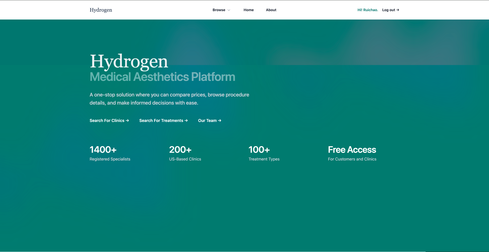

# Hydrogen - MedicalAestheticsPlatform
## Project Objective
It is a website aiming to offer transparent prices of medical aesthetic services. Creating a website to fix this information gap could help hesitant customers take actions while bringing clinics more clients – a win-win situation.


## Author 
- Ruichao Tang

## Class Link
- https://johnguerra.co/classes/webDevelopment_spring_2025/

## Design Doc
- https://github.com/RuichaoTang/MedicalAestheticsPlatform/blob/main/resources/Hydrogen%20-%20Design%20Doc.pdf

## Framework Used
- Node.js
- Express
- React
- MongoDB
- TailwindCss

## Screenshot



## Instructions to build
- In The First Teminal (Backend)
```bash
git clone https://github.com/yourusername/project-name.git](https://github.com/RuichaoTang/MedicalAestheticsPlatform.git
cd MedicalAetheticsPlatform
npm install
node --watch index.js
```

- In The Second Terminal (Frontend)
```
cd frontend
npm install
npm run dev
```
-Note that .env file is not uploaded


## Other Project Requirements
- 1000+ user data implemented in mongoDB
  


